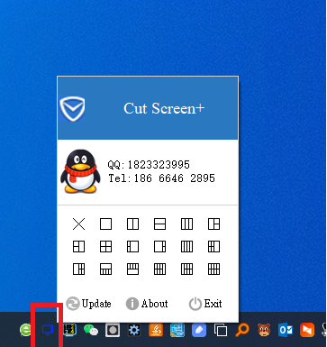
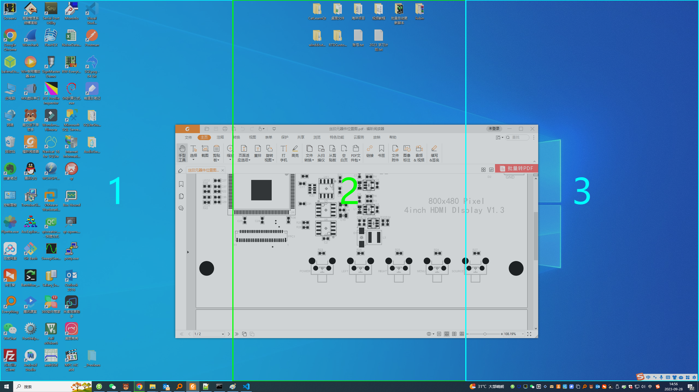
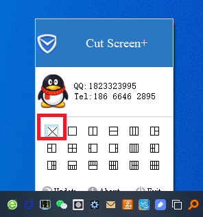

# Cut Screen+

#### 介绍
Cut Screen+是一款仿Screen+的电脑分屏软件. 
简易实用,功能全面，如果我们需要同时对多个窗口进行操作，就可以使用Cut Screen+分屏软件，节省时间，提高工作效率，有多种分屏模式，支持开机运行。您可以根据自己使用电脑的需求，来选择对应的布局形式，还能对布局进行相应的调整，有多种分屏模式可以选择.

#### 安装教程

安装过程比较简单，解压缩下载的文件后运行exe文件，按提示进行下一步操作即可

#### 使用说明

1.在任务栏找到Cut Screen+软件的图标，点击鼠标右键，可以打开软件菜单,即可显示软件已经定义好的布局  
  

2.我们选择第五个布局，然后看一下效果。只需把打开的软件拖动到屏幕的对应位置上，窗口就会被自动调整为该布局的大小。  
  

3.如果要退出这个布局，选择X按钮，这样就相当于没有运行Cut Screen+的软件一样的效果了.
 

#### 为什么开发 Cut Screen？
1.实际工作中经常会遇到窗口多开的情况, 有使用AOC 的Screen+觉得不错，就想着复刻这个软体.

#### 关于作者
一枚普通的程序员，工作中主要使用 C++ 进行桌面客户端开发，主要做一些和硬件相关的上位机及自动化软件。

